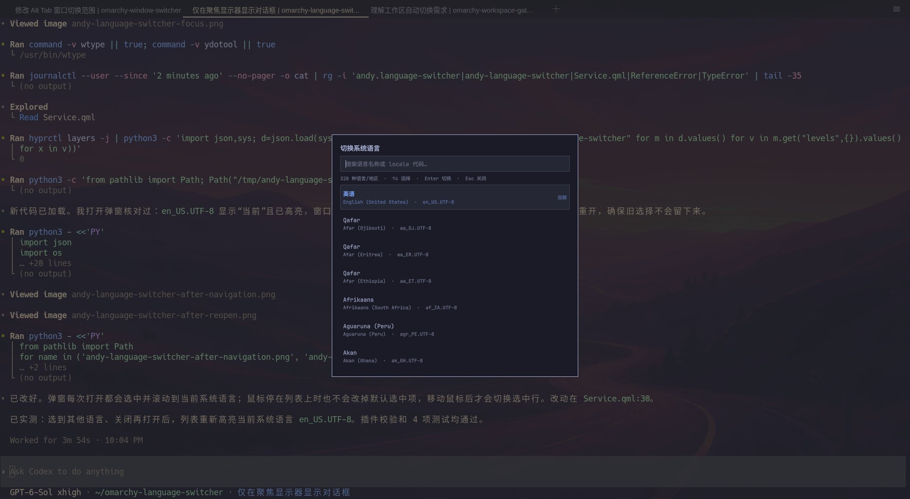

# Omarchy Language Switcher

English | [简体中文](README.zh-CN.md)



[Preview from the original post](https://x.com/manateelazycat/status/2103848803740893201)

**License: GPL 3.0**

An Omarchy Shell plugin for changing the system language. Click the language icon in the bar to search and select a locale on the focused monitor.

## Features

- Lists every UTF-8 locale supported by the system and marks the current and installed locales.
- Selects the current system locale when opened. Search by Chinese, English, native language name, or locale code.
- Generates a missing locale with `locale-gen` after graphical administrator authorization, then sets the system `LANG` with `localectl`.
- Shows progress and the result on the same monitor. Sign out and sign back in for a successful change to take effect.

The plugin changes the system locale. It does not change the keyboard layout or input method.

## Install

```bash
git clone https://github.com/manateelazycat/omarchy-language-switcher.git
cd omarchy-language-switcher
./install.sh
```

Run the installer as your normal user. It asks for `sudo` authorization to install the executable helper at `/usr/local/libexec/omarchy-language-switcher-helper` with root ownership and mode `0755`. The plugin runs this installed copy for both listing and applying locales; the user-writable clone is never executed with administrator privileges.

The installer also links this directory to `~/.config/omarchy/plugins/andy.language-switcher`, backs up `shell.json`, enables the plugin, and adds its icon to the right side of the bar. Keep the cloned directory in place. Run `./install.sh` again after updating the clone to update the installed helper.

## Use

Click the language icon in the bar or run `omarchy-shell andy.language-switcher show`. Use `↑` and `↓` to select a language, `Enter` to switch, and `Esc` to close the dialog.

## Remove

```bash
./uninstall.sh
```

The uninstaller removes the Omarchy plugin link and uses `sudo` to remove the root-owned helper. Your local clone is not deleted.

## Requirements

Omarchy Shell, Hyprland, Python 3, `locale-gen`, `localectl`, `pkexec`, `sudo`, and a graphical Polkit authentication agent. The installer also uses `jq`. Available translations depend on the language packs installed on your system.

## License

Omarchy Language Switcher is licensed under the GNU General Public License version 3.0 only (`GPL-3.0-only`). See [LICENSE](LICENSE) for the full terms.
